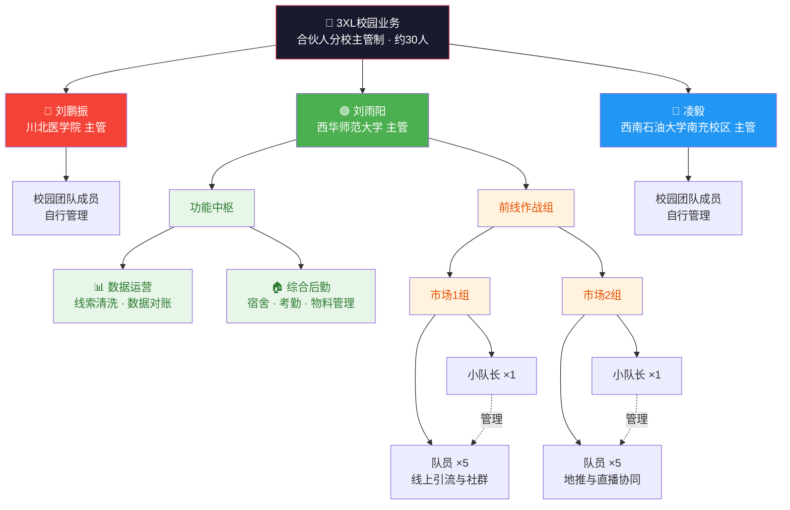

# 3XL校园业务 — 企业组织架构图

> 团队总规模约 30 人 | 合伙人分校主管制 | 三位负责人各自独立管理不同高校

---

## 一、Markdown 层级树状图

### 🏛️ 合伙人层（并列平级，各自独立主管对应高校）

- **刘鹏振** — 全面主管【川北医学院】校区，管理与运营模式独立
- **刘雨阳** — 全面主管【西华师范大学】校区，负责全权落地飞书数智化运营、双轨制薪酬与直播方案
- **凌毅** — 全面主管【西南石油大学南充校区】，管理与运营模式独立

### 🟢 西华师范大学校区 细分架构（直接向刘雨阳汇报）

- **刘雨阳**（校区主管）
  - **功能中枢**
    - 数据运营：负责西华师大校区的线索清洗与数据对账
    - 综合后勤：负责西华师大校区的宿舍、考勤与物料管理
  - **前线作战组**
    - **市场1组**
      - 市场1组小队长（1名）
      - 校园市场队员（5名）：负责线上引流与社群
    - **市场2组**
      - 市场2组小队长（1名）
      - 校园市场队员（5名）：负责地推与直播协同

### 🔴 川北医学院校区

- **刘鹏振**（校区主管）
  - 校园团队成员（由刘鹏振自行管理，架构待细化）

### 🔵 西南石油大学南充校区

- **凌毅**（校区主管）
  - 校园团队成员（由凌毅自行管理，架构待细化）

---

## 二、Mermaid 组织架构图

---

## 三、架构说明

| 层级 | 角色 | 职责 |
|------|------|------|
| **合伙人层** | 刘鹏振、刘雨阳、凌毅 | 三位合伙人并列平级，各自独立管理对应高校，互不干涉内部运营 |
| **功能中枢** | 数据运营、综合后勤 | 仅西华师大设立，支撑校区的核心业务流程 |
| **前线作战组** | 市场1组、市场2组 | 每组 1 名小队长 + 5 名队员，分别负责线上引流/社群与地推/直播 |
| **其他校区** | 校园团队成员 | 由对应主管自行组建与管理 |

> 📌 川北医学院与西南石油大学南充校区架构暂时留白，下方直接挂载各自校园团队成员，后续由刘鹏振与凌毅自行细化。
