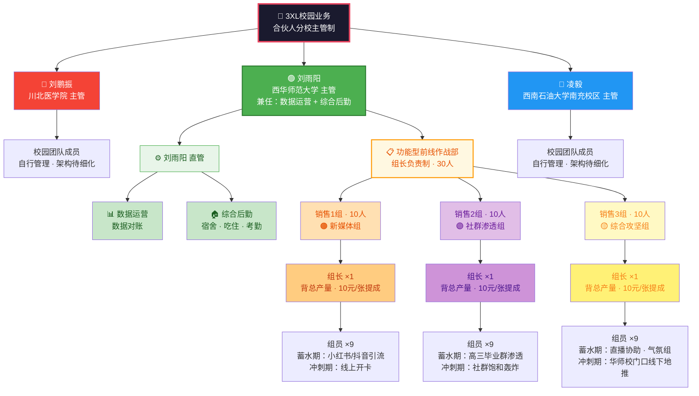

# 3XL校园业务 — 企业组织架构图

> 合伙人分校主管制 | 西华师大校区 30 人团队 | 组长负责制 · 高度扁平化

---

## 一、Markdown 层级树状图

### 🏛️ 合伙人层（并列平级，各自独立主管对应高校）

- **刘鹏振** — 全面主管【川北医学院】校区，管理与运营模式独立
- **刘雨阳** — 全面主管【西华师范大学】校区，兼任数据运营与综合后勤
- **凌毅** — 全面主管【西南石油大学南充校区】，管理与运营模式独立

### 🟢 西华师范大学校区 细分架构（组长负责制 · 30人）

- **刘雨阳** — 战区总指挥（校区负责人）
  - 兼任 **数据运营**：直接管控数据对账
  - 兼任 **综合后勤管理**：直接管控宿舍吃住及考勤
  - **功能型前线作战部**（直接向刘雨阳汇报）
    - **销售 1 组**（10人）— 新媒体组
      - 销售1组组长 ×1：背团队总产量，拿 10元/张 管理提成
      - 新媒体组员 ×9：蓄水期主攻小红书/抖音引流，冲刺期主攻线上开卡
    - **销售 2 组**（10人）— 社群渗透组
      - 销售2组组长 ×1：背团队总产量，拿 10元/张 管理提成
      - 社群渗透组员 ×9：蓄水期主攻高三毕业群渗透，冲刺期主攻社群饱和轰炸
    - **销售 3 组**（10人）— 综合攻坚组
      - 销售3组组长 ×1：背团队总产量，拿 10元/张 管理提成
      - 综合攻坚组员 ×9：蓄水期主攻直播间协助与气氛组，冲刺期主攻华师校门口线下地推

### 🔴 川北医学院校区

- **刘鹏振**（校区主管）
  - 校园团队成员（由刘鹏振自行管理，架构待细化）

### 🔵 西南石油大学南充校区

- **凌毅**（校区主管）
  - 校园团队成员（由凌毅自行管理，架构待细化）

---

## 二、Mermaid 组织架构图

---

## 三、西华师大校区 · 架构说明

| 层级 | 角色 | 人数 | 职责与绩效 |
|------|------|------|------------|
| **战区总指挥** | 刘雨阳 | 1人 | 全面负责校区，兼任数据运营（数据对账）与综合后勤（宿舍/吃住/考勤） |
| **销售1组组长** | — | 1人 | 背团队总产量，拿 10元/张 管理提成 |
| **销售1组组员** | 新媒体组 | 9人 | 蓄水期：小红书/抖音引流；冲刺期：线上开卡 |
| **销售2组组长** | — | 1人 | 背团队总产量，拿 10元/张 管理提成 |
| **销售2组组员** | 社群渗透组 | 9人 | 蓄水期：高三毕业群渗透；冲刺期：社群饱和轰炸 |
| **销售3组组长** | — | 1人 | 背团队总产量，拿 10元/张 管理提成 |
| **销售3组组员** | 综合攻坚组 | 9人 | 蓄水期：直播协助·气氛组；冲刺期：线下地推 |
| **合计** | — | **30人** | 战区总指挥 1人 + 3组 × 10人 |

---

## 四、薪资机制速览

| 角色 | 薪酬模式 |
|------|----------|
| **组长**（3名） | 背团队总产量，管理提成 **10元/张** |
| **组员**（27名） | 按个人开卡/引流产出结算（具体方案由各组长制定） |
| **总指挥** | 校区整体利润分成 |

---

## 五、其他校区

| 校区 | 主管 | 状态 |
|------|------|------|
| 川北医学院 | 刘鹏振 | 自行管理，架构待细化 |
| 西南石油大学南充校区 | 凌毅 | 自行管理，架构待细化 |

> 📌 川北医学院与西南石油大学南充校区架构暂时留白，下方直接挂载各自校园团队成员，后续由对应主管自行细化。
