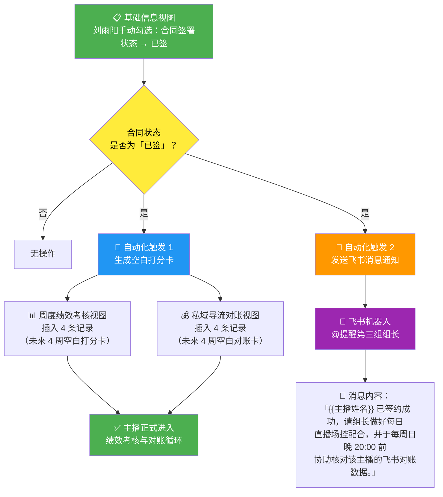

# 主播劳务合同与绩效对账一体化系统

> 西华师范大学校区 · 刘雨阳 | 30人团队 | 极简自动化数字管理

---

## 模块一：飞书多维表格 · 主播数据与资产底座

### 表格总览

飞书多维表格一张表，四个视图，共用同一张数据表：

| 视图 | 用途 | 使用频率 |
|------|------|----------|
| 📋 基础信息视图 | 主播档案 + 合同状态 | 入职/签约时更新 |
| 📱 新媒体资产视图 | 账号资产登记与确权 | 入职登记 + 每周更新 |
| 📊 周度绩效考核视图 | 内容绩效打分与定级 | 每周打分 |
| 💰 私域导流对账视图 | 私域转化数据对账 | 每周对账 |

---

### 视图一：📋 基础信息视图

| 字段名称 | 字段类型 | 必填 | 说明 |
|----------|----------|------|------|
| 主播编号 | 自动编号 | 是 | 系统自动生成，格式：ZB-001 |
| 姓名 | 文本 | 是 | 主播真实姓名 |
| 手机号 | 电话 | 是 | 本人实名手机号 |
| 身份证号 | 文本 | 是 | 18位身份证号码 |
| 所属组别 | 单选 | 是 | 选项：销售1组 / 销售2组 / 销售3组 |
| 所属组长 | 关联 | 是 | 关联「组长管理表」对应组长记录 |
| 入职日期 | 日期 | 是 | 格式：YYYY-MM-DD |
| 运营平台 | 多选 | 是 | 选项：小红书 / 抖音 / 视频号 / B站 |
| 合同电子签署状态 | 单选 | 是 | 选项：未签 / 已签（⚠️ 触发自动化） |
| 合同签署日期 | 日期 | 否 | 签署后自动填入 |
| 合同编号 | 文本 | 否 | E-Sign 合同编号，签署后自动回填 |
| 当前状态 | 单选 | 是 | 选项：在职 / 离职 / 停播 |
| 备注 | 多行文本 | 否 | 特殊事项记录 |

---

### 视图二：📱 新媒体资产视图

| 字段名称 | 字段类型 | 必填 | 说明 |
|----------|----------|------|------|
| 主播编号 | 引用 | 是 | 关联基础信息 |
| 姓名 | 引用 | 是 | 关联基础信息 |
| 运营平台 | 单选 | 是 | 小红书 / 抖音 / 视频号（每条记录一个平台） |
| 账号名称 | 文本 | 是 | 平台上的账号昵称 |
| 账号ID | 文本 | 是 | 平台唯一标识（UID） |
| 绑定手机号 | 电话 | 是 | 账号绑定的手机号（须与实名一致） |
| 粉丝数 | 数字 | 否 | 当前粉丝总量 |
| 历史爆款数 | 数字 | 否 | 播放量 10万+ 的视频数量 |
| 账号最高在线 | 数字 | 否 | 历史最高同时在线人数 |
| 账号所有权声明 | 多行文本 | 是 | ⚠️ 固定文本：「本账号及全部粉丝、内容资产无条件归属甲方（刘雨阳/3XL团队），乙方仅享有运营权。」 |
| 最后更新时间 | 日期 | 否 | 资产数据最近更新时间 |

---

### 视图三：📊 周度绩效考核视图

| 字段名称 | 字段类型 | 必填 | 说明 |
|----------|----------|------|------|
| 主播编号 | 引用 | 是 | 关联基础信息 |
| 姓名 | 引用 | 是 | 关联基础信息 |
| 所属组别 | 引用 | 是 | 关联基础信息 |
| 考核周次 | 文本 | 是 | 格式：2026-W23（第23周） |
| 视频播放得分 | 数字 | 是 | 0-100 分，按播放量梯度评定 |
| 内容质量得分 | 数字 | 是 | 0-100 分，组长评分 |
| 履职积极性得分 | 数字 | 是 | 0-100 分，依据出勤/场次 |
| 团队贡献度得分 | 数字 | 是 | 0-100 分，组长评定 |
| 🔢 **内容绩效最终得分** | **公式** | — | `=视频播放得分 + 内容质量得分 + 履职积极性得分 + 团队贡献度得分` |
| 🏅 **内容绩效定级** | **公式** | — | 见下方分级规则 |
| 组长评语 | 多行文本 | 否 | 本周表现点评 |
| 记录时间 | 创建时间 | 否 | 自动记录 |

**绩效定级公式规则：**

| 最终得分 | 定级 | 绩效系数 |
|----------|------|----------|
| ≥ 360 | 🥇 优异 | 1.2 |
| ≥ 320 | 🥈 良好 | 1.0 |
| ≥ 280 | 🥉 合格 | 0.8 |
| < 280 | ⚠️ 待改进 | 0.5 |

---

### 视图四：💰 私域导流对账视图

| 字段名称 | 字段类型 | 必填 | 说明 |
|----------|----------|------|------|
| 主播编号 | 引用 | 是 | 关联基础信息 |
| 姓名 | 引用 | 是 | 关联基础信息 |
| 对账周次 | 文本 | 是 | 格式：2026-W23 |
| 周有效加群人数 | 数字 | 是 | 本周实际进群且未退群的人数 |
| 精准咨询量 | 数字 | 是 | 主动咨询套餐/价格的用户数 |
| 留存质量得分 | 数字 | 是 | 0-100 分，依据 7 日留存率 |
| 🔢 **私域导流最终得分** | **公式** | — | `=周有效加群人数×1 + 精准咨询量×2 + 留存质量得分×0.5` |
| 🏅 **导流定级** | **公式** | — | ≥ 80 优异 / ≥ 60 良好 / ≥ 40 合格 / < 40 待改进 |
| 对账确认 | 复选框 | 是 | 组长与主播双方确认后勾选 |
| 对账备注 | 多行文本 | 否 | 异常说明 |

---

## 模块二：飞书电子合同 · 主播专属劳务协议

### 3XL校园业务 · 主播劳务合作协议

**协议编号**：ZB-{{主播编号}}-{{签署日期}}

**甲方（雇主）**：刘雨阳（3XL校园业务 · 西华师范大学校区）

**乙方（主播）**：{{乙方姓名}}

**身份证号**：{{乙方身份证}}

**联系电话**：{{乙方手机号}}

**签约日期**：{{签署日期}}

---

#### 第一条 · 合作内容与岗位

1.1 乙方以**校园主播**身份加入甲方运营团队，归属 **{{所属组别}}**，接受组长 **{{所属组长}}** 的日常管理。

1.2 乙方工作内容包括但不限于：短视频拍摄与发布、直播出镜、社群引流与维护、线下活动配合。

1.3 合作期限自 {{入职日期}} 起，试用期 {{试用期月数}} 个月。试用期满经考核合格后自动转为正式合作。

---

#### 第二条 · 🔒 账号所有权与粉丝资产（核心风控条款）

> ⚠️ **本条为甲方核心权益条款，乙方签署即视为充分理解并自愿接受。**

2.1 **所有权归属**：乙方在职期间，以甲方团队名义注册和使用的全部平台账号（包括但不限于小红书、抖音、视频号、B站）、账号内粉丝资产、私域社群资产，**所有权无条件、唯一、永久归属甲方（刘雨阳 / 3XL校园业务团队）**。乙方仅享有甲方授权下的运营使用权。

2.2 **离职移交**：合作终止时，乙方须在 **24 小时内** 完成全部账号的密码移交、绑定手机号更换为甲方指定号码、管理员权限转移。每逾期一天，扣除未结劳务报酬的 20% 作为违约金。

2.3 **禁止行为**：乙方严禁私自修改账号密码、删除历史视频/图文内容、转移粉丝至个人账号、或将甲方账号资产用于任何非甲方授权的商业活动。违反本条的，甲方有权要求乙方按 **账号估值 ×3 倍** 赔偿，并保留追究法律责任的权利。

---

#### 第三条 · 🛡️ 内容言论合规（核心风控条款）

> ⚠️ **本条为双方共同风险防控条款。**

3.1 **绝对禁止**：乙方在全部运营行为中，严禁出现以下内容：

- 政治敏感言论（含隐喻、暗语、谐音规避）
- 色情、低俗、擦边内容
- 虚假承诺（包括但不限于："绝对不限速"、"终身不销户"、"100%过审"等绝对化用语）
- 诋毁同行、恶意引流
- 未经甲方书面授权的品牌合作内容

3.2 **违规处罚**：因乙方违规内容导致账号被限流、降权、封禁的：

- 扣除违规当月**全部绩效报酬**
- 乙方须**全额赔偿**甲方因此产生的直接及间接损失（包括账号价值减损、广告合约违约金、运营补救成本）
- 情节严重导致永久封号的，甲方有权立即解除合作并要求乙方赔偿账号估值

---

#### 第四条 · 📸 知识产权与肖像权永久授权（核心风控条款）

4.1 **版权归属**：乙方在职期间拍摄的全部短视频、直播回放、图文素材、口播文案，其著作权、邻接权、信息网络传播权**完整归属甲方**。

4.2 **肖像权永久授权**：乙方在此**不可撤销地、永久地、免费地、全球范围内**授权甲方及其关联方，在合作期间及合作终止后，继续使用乙方的肖像、声音、艺名、网络昵称，用于商业宣传、内容二次创作、广告投放等用途。乙方不得以任何理由要求删除已发布内容或主张额外费用。

4.3 **竞业限制**：合作终止后 **6 个月内**，乙方不得在同城市（南充市）范围内，为与甲方存在直接竞争关系的校园通信业务团队从事主播、运营、培训等工作。

---

#### 第五条 · 📊 飞书数据存证（核心风控条款）

5.1 **唯一法定依据**：所有考核打分、扣分、绩效计算、对账数据，**完全以飞书多维表格中的历史存证记录为唯一法定依据**。乙方可通过飞书客户端随时查阅、核对自己的全部考核数据。

5.2 **异议处理**：乙方对考核数据有异议的，须在考核记录生成后 **48 小时内** 通过飞书提交申诉。逾期未申诉的，视为对考核结果无异议。

5.3 **证据效力**：双方确认，飞书多维表格中的电子记录与纸质签字文件具有同等法律效力。

---

#### 第六条 · 薪酬结构与结算

**6.1 薪酬构成**（详见多维表格"薪酬对账"视图）：

| 项目 | 计算方式 |
|------|----------|
| 基础劳务费 | 按出勤天 × 日基准 |
| 内容绩效 | 基础劳务费 × 绩效系数 |
| 私域导流提成 | 有效加群人数 × 提成单价 |
| 组长管理提成 | 仅组长享有，10元/张 |

**6.2 结算周期**：每周一统计上周数据，每月 5 日发放上月劳务报酬。

---

#### 签章区

| | |
|---|---|
| **甲方（雇主）** | **乙方（主播）** |
| 姓名：刘雨阳 | 姓名：{{乙方姓名}} |
| 身份证号：{{甲方身份证}} | 身份证号：{{乙方身份证}} |
| 飞书用户ID：ou_b9ef0fb5ff27adbeb3ef342fe8856b02 | 飞书用户ID：{{乙方飞书OpenID}} |
| {{甲方签字}} | {{乙方签字}} |

---

## 模块三：飞书自动化流水线

### 整体自动化链路



---

### 自动化流程详细步骤

| 步骤 | 触发条件 | 执行动作 | 负责人/系统 |
|------|----------|----------|-------------|
| **Step 1** | 刘雨阳在「基础信息视图」将主播合同状态改为「已签」 | 飞书自动化检测字段变更 | 🤖 自动化 |
| **Step 2a** | Step 1 触发 | 在「周度绩效考核视图」批量创建 4 条记录（未来 4 周，每周一条空白打分卡），主播编号、姓名、所属组别自动填入 | 🤖 自动化 |
| **Step 2b** | Step 1 触发 | 在「私域导流对账视图」批量创建 4 条记录（未来 4 周，每周一条空白对账卡），主播编号、姓名自动填入 | 🤖 自动化 |
| **Step 3** | Step 1 触发 | 飞书机器人向**对应组组长**发送通知消息（见下方模板） | 🤖 飞书机器人 |
| **Step 4** | 每周日 20:00 | 组长协助核对本周数据，填写打分与对账 | 👤 各组组长 |
| **Step 5** | 每周一 09:00 | 刘雨阳审核上周全部主播的绩效定级与对账数据 | 👤 刘雨阳 |
| **Step 6** | 每月5日 | 系统汇总月度数据，生成薪酬结算表 | 🤖 自动化 |

---

### 飞书机器人通知模板

```text
📢 新主播签约通知

主播【{{主播姓名}}】已于 {{签署日期}} 完成电子签约！

━━━━━━━━━━━━━━━
📋 基本信息
━━━━━━━━━━━━━━━
• 主播编号：{{主播编号}}
• 所属组别：{{所属组别}}
• 运营平台：{{运营平台}}

━━━━━━━━━━━━━━━
✅ 组长待办事项
━━━━━━━━━━━━━━━
1. 做好每日直播场控配合
2. 每周日晚 20:00 前，登录飞书多维表格核对该主播的：
   📊 周度绩效考核数据
   💰 私域导流对账数据
3. 数据异常及时与主播沟通并备注

━━━━━━━━━━━━━━━
📌 数据入口
━━━━━━━━━━━━━━━
点击进入多维表格 👇
{{多维表格链接}}

— 3XL校园业务 · 数字化运营系统
```

---

### 自动化配置清单（飞书后台操作指南）

| 配置项 | 位置 | 操作 |
|--------|------|------|
| 创建多维表格 | 飞书 → 新建 → 多维表格 | 按模块一创建 4 个视图 |
| 开通飞书电子签 | 飞书开放平台 → 应用 → 电子签 | 开通并配置合同模板（模块二） |
| 配置自动化规则 | 多维表格 → 自动化 → 新建 | 触发器：记录满足条件（合同状态=已签） |
| 配置消息推送 | 飞书开放平台 → 机器人 | 创建自定义机器人，获取 Webhook 地址 |
| 绑定 Webhook | 多维表格 → 自动化 → 执行动作 | 执行动作类型选「发送飞书消息」 |
| 测试自动化 | 新增一条测试主播记录 | 验证打分卡生成 + 消息推送 |
